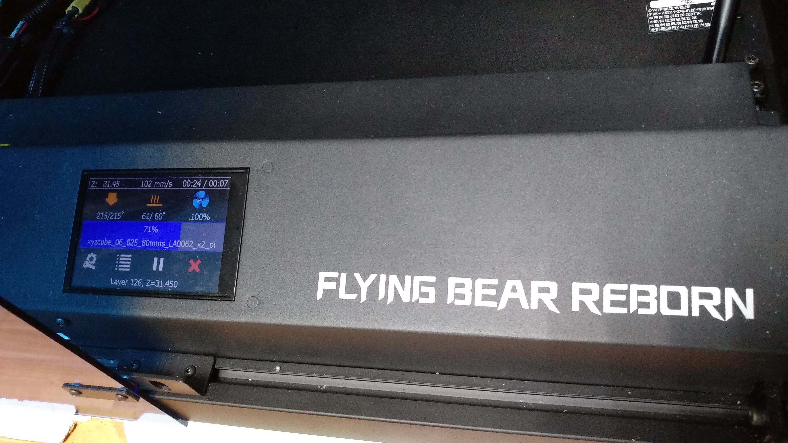
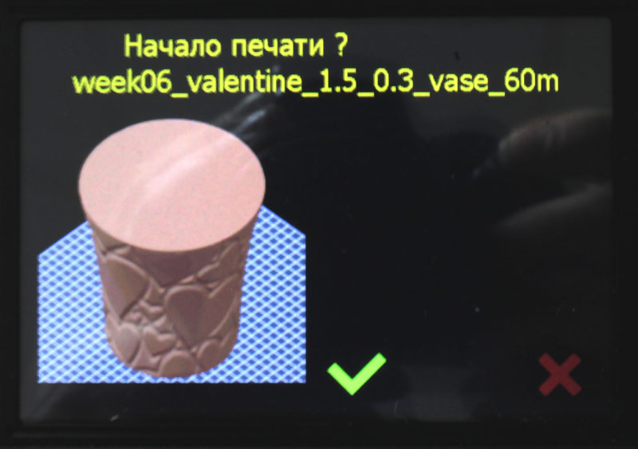
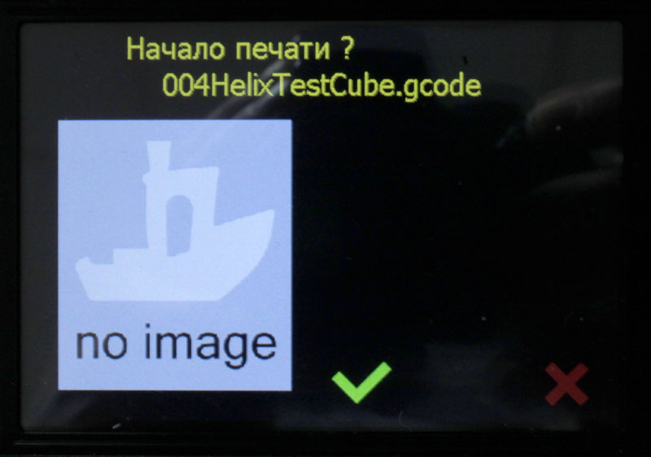

[English](#english-version)
<p align="center">
  
</p>

# Прошивка MarlinRB для принтера Flyingbear Reborn

### Собранные готовые файлы прошивки находятся в [разделе Releases](https://github.com/Andy-Big/Marlin_FB_Reborn/releases)

Работает с платами: **MKS Robin Nano v1.3** (съемные драйвера, контроллер STM32F407), **MKS Robin Nano S v1.3** (несъемные драйвера, контроллер STM32F407) и **MKS Robin Nano v1.1** (красная плата со съемными драйверами, контроллер STM32F103, может иметь название Flyingbear Reborn v2.0).


Основана на [Marlin 3D Printer Firmware](https://github.com/MarlinFirmware/Marlin)  версии 2.1

## Содержание
* [Главное](#главное)
* [Соответствие вариантов прошивки разным платам](#соответствие-вариантов-прошивки-разным-платам)
* [Новый главный экран интерфейса](#новый-главный-экран-интерфейса)
* [Отображение предпросмотра](#отображение-предпросмотра)
* [Установка](#установка)
* [Настройка WiFi](#настройка-WiFi)
* [Подключение Z-зонда 3D-touch/BL-touch](#Подключение-Z-зонда-3D-touch-BL-touch)
* [Работа прошивки с командой M73](#работа-прошивки-с-командой-M73)
* [Сохранение и загрузка параметров в файл .ini](#Сохранение-и-загрузка-параметров-в-файл-ini)
* [История](#история)

## Главное
Обновлено 28.07.2022
- WiFi интерфейс для управления принтером и передачи файлов
- активирован Linear Advance
- активирована возможность использовать встроенные в прошивку ретракты (командами G10, G11)
- отображение картинки предпросмотра при выборе файла (поддерживается предпросмотр PrusaSlicer и только на платах Robin Nano v1.3 и Robin Nano S v1.3)
- активен датчик окончания филамента
- предусмотрено подключение модуля управления питанием (PSU) MKS PWC
- добавлена настройка автоматического отключения питания по окончанию текущей печати (при подключенном модуле управления питанием)
- добавлена настройка направления вращения моторов X/Y/Z/Z2/E
- добавлена настройка инверсии концевиков
- включена калибровка стола ("Выровнять стол" с ручной подгонкой высоты сопла по 9 точкам)
- включена подстройка винтами стола по 4 точкам, соответствующим положению регулировочных винтов ("Выровнять углы")
- исправлены все косяки вывода русскоязычных надписей
- поддержка русских имен файлов
- по умолчанию стоит ограничение на ускорения осей - 3000 мм/сек\*сек, скорость - 250 мм/сек
- интерфейс - стандартный графический с измененным главным экраном
- выбор языка интерфейса - английский или русский
- хранение настроек (EEPROM) во внешней SPI-флэш W25Q64
- настраиваемое количества точек сетки выравнивания стола
- цветовая карта высот сетки выравнивания стола
- сохранение и загрузка настроек в файл .ini на SD-карте ([подробнее](#Сохранение-и-загрузка-параметров-в-файл-ini))

## Соответствие вариантов прошивки разным платам
Прошивка собрана в нескольких вариантах, каждый из которых подходит к определенной плате, которая встречается в принтере Reborn.
1. **v_Robin_Nano_1.1** - предназначена для плат MKS Robin Nano v1.1, известной так же как Flyingbear Reborn v2.0 в стоковой конфигурации.
<p align="left"></p>

2. **v_Robin_Nano_1.3** - предназначена для плат MKS Robin Nano v1.3 со съемными драйверами в стоковой конфигурации.
<p align="left"></p>

3. **v_Robin_Nano_S_1.3** - предназначена для плат MKS Robin Nano S v1.3 с четырьмя впаянными и одним съемным драйверами в стоковой конфигурации.
Вариант **v_Robin_Nano_SM_1.3** подходит для этих же плат если пользователем были переставлены разъемы E0 и E1, то есть мотор экструдера был подключен к съемному драйверу
<p align="left"></p>

## Новый главный экран интерфейса
Главный экран был полностью переработан для обоих режимов - в простое и при печати.

### Новый главный экран в режиме простоя

Убран блок с координатами осей, его место в центре экрана теперь занимает полоса прогресса печати. Координаты осей X и Y в подавляющем большинстве случаев не нужны пользователю на главном экране, поэтому они полностью удалены. Координата оси Z перенесена в верхнюю строку состояния.
Вверху экрана добавлена строка состояния, в которой отображаются координата оси Z, текущая скорость движения сопла и время печати. В режиме простоя время печати будет показывать время последней завершенной печати или нули если после включения принтера печать не производилась.
Показания значений температуры сопла и стола, а так же вращения кулера указываются одной строчкой под соответствующей иконкой. Изменение цвета иконки происходит следующим образом:
- для сопла: **серая** - пока температура меньше минимальной температуры экструзии (экструдер не будет работать при такой температуре); **желтая** - если температура выше минимальной температуры экструзии, но меньше заданной; **красная** - температура равна заданной плюс-минус 3 градуса (параметр TEMP_HYSTERESIS в файле Configuration.h)
- для сопла: **серая** - пока температура меньше 40°C; **желтая** - если температура выше 40°C, но меньше заданной; **красная** - температура равна заданной плюс-минус 3 градуса (параметр TEMP_HYSTERESIS в файле Configuration.h)
- для кулера: **серая** - пока вращение меньше 10%; **синяя** - если вращение больше или равно 10%
Как и в старом интерфейсе, нажатие на иконку сопла, стола или кулера вызовет переход на изменение соответствующего показателя.
Самой заметной частью экрана является показатель прогресса печати в средней части экрана. Он сделан в виде очень толстой полосы прогресса на всю ширину экрана для того, чтобы можно было даже издалеко оценить выполнение печати. В нем так же имеется и цифровой показатель процентов завершения печати. В режиме простоя этот показатель равен нулю.
Под прогрессом печати располагаются иконки действий. Для режима простоя предусмотрено три действия из основного меню: выбор файла для печати, вход в главное меню и переход на экран управлени осями и хомления.
В самом низу экрана находится место для сообщений системы или слайсера (через код M117).

### Новый главный экран в режиме печати

Здесь все аналогично эерану простоя, но с некоторыми изменениями.
В строке статуса время печати дополняется через "/" предполагаемым оставшимся временем печати. Этот показатель появляется не сразу, а через одну минуту после начала печати (не считая времени ожидания нагрева стола и сопла). До этого момента там отображаются прочерки. Цвет времени печати красный пока идет ожидание нагрева сопла или стола.
Под иконками сопла и стола показатель текущей температуры дополняется показателем заданной температуры.
В полосе прогресса под значением процентов пишется имя печатаемого файла.
Иконки действий под прогрессом меняются на следующие: перейти в меню подстроек (Tune), перейти в главное меню, поставить печать на паузу и прервать печать (с подтверждением).

## Отображение предпросмотра
В прошивку была добавлена возможность показывать при выборе файла изображение предпросмотра, которое некоторые слайсеры умеют встраивать в файл с g-кодом.
При выборе файла из списка открывается окно подтверждения начала печати. Если в этом файле имеется встроенное изображение предпросмотра и оно удовлетворяет ограничениям, это изображение будет показано в левой части экрана. Изображение автоматически масштабируется под размер, который поместится на экране.



Если в файле нет встроенного изображения предпросмотра или оно в неподдерживаемом формате, то отобразится иконка по умолчанию.



На текущий момент отображение предпросмотра имеет следующие ограничения:
- поддерживается только предпросмотр, генерируемый слайсером PrusaSlicer; изображения, встраиваемые другими слайсерами будут проигнорированы;
- из-за больших требований к оперативной памяти предпросмотр работает только на платах Robin Nano v1.3 и Robin Nano S v1.3 с контроллером STM32F407; на платах Robin Nano v1.2 с контроллером STM32F103 будет отображен обычный экран подтверждения печати файла, без предпросмотра;
- изображение предпросмотра должно иметь ширину и высоту не меньше 100 и не больше 640 пикселей; изображения с другими размерами будут проигнорированы;
- встроенное изображение должно располагаться в начале файла с g-кодом, его начало должно быть в первых 65 кб файла;

## Установка
Внимание! Убедитесь, что в Вашем принтере совместимая плата управления!
1. Загрузить релиз последней версии.
2. Распаковать архив, скопировать файл Robin_nano35.bin в корень карты памяти (желательно перед этим карту памяти отформатировать).
3. Выключить принтер, вставить в него карту памяти, включить принтер.
4. В течении 10-15 секунд принтер должен обновить прошивку. Процесс обновления отображается на дисплее.
5. При первом обновлении прошивки со штатной система может после загрузки автоматически перейти в режим калибровки тач-дисплея.
6. Крайне рекомендуется после обновления прошивки со штатной на Марлин зайти в меню настроек с сделать сброс настроек на заводские значения.


## Настройка WiFi
К сожалению, настройка WiFi (имя точки доступа и пароль) пока никак не реализована. Чтобы настроить работу WiFi, нужно сделать это в родной прошивке (от MKS), после чего можно обновляться на эту прошивку. Параметры настройки сохранятся.

## Подключение Z-зонда 3D-touch (BL-touch)
Зонд 3D-touch или BL-touch могут быть подключены к платам Robin Nano v1.3 и Robin Nano S v1.3. На красных платах Robin Nano v1.1 (они же - Reborn 2.0) подключение BL-touch, к сожалению, не предусмотрено.

Выше на картинке показано как подключить 3D-touch. Цвета проводов здесь соответствуют 3D-touch от Triangle Labs. У других зондов цвета могут отличаться, необходимо будет сопоставить их назначение с указанными на картинке.
Трехконтактный разъем:
- коричневый - земля
- красный - +5 В
- желтый - SERVO

Двухконтактный разъем:
- черный - земля
- белый - SIGNAL OUT

## Работа прошивки с командой `M73`
Команда `M73` вставляется в g-код слайсером. В этой команде слайсер указывает текущий процент выполнения печати и оставшееся время в минутах. Как правило, слайсер оценивает эти параметры гораздо точнее принтера, поэтому предпочтительнее выводить процент печати и оставшееся время именно по данным из этой команды.
Когда прошивка встречает эту команду в коде, она выводит данные из нее в прогресс печати и счетчик оставшегося времени. Если счетчик времени зеленого цвета - значит он получает данные из команды `M73`. Если слайсер не поддерживает эту команду или если по каким-то причинам прощивка не встречает эту команду в течении 3 минут, то она переходит на расчет прогресса и оставшегося времени по внутреннему методу - исходя из размера файла и количества уже считанных из него байт. В этом случае счетчик времени обычного серого цвета.

## Сохранение и загрузка параметров в файл .ini
В прошивке имеется возможность сохранить основные настройки принтера в файл на SD-карте и загрузить их из него. Это можно сделать как из меню, так и командами через терминал. Это может быть полезным, например, для того, чтобы не настраивать все заново при сбросе настроек принтера на заводские. После первой настройки всех параметров Вы можете сохранить настройки в файл и скопировать этот файл себе на компьютер на будущее. А когда появится необходимость восстановить настройки - скопировать этот файл на SD-карту и восстановить из него настройки на принтере.
Для сохранения настроек из меню зайдите в меню Настройки и нажмите пункт `Сохранить настройки в файл`. Настройки будут сохранены в файл по умолчанию с именем `printer_settings.ini` в корне SD-карты.
Чтобы загрузить настройки из файла зайдите в меню списка файлов, выберите файл с настройками (файл должен иметь расширение .ini) и подтвердите загрузку настроек из него.
Сохранение и восстановление настроек командами через терминал производится с помощью команд `M5000` и `M5001`. После команды может следовать необязательный параметр - имя файла. Если имя файла не указано, то оно будет принято за имя по умолчанию - `printer_settings.ini` в корне SD-карты.
Файл настроек - это текстовый файл с очень простой структурой. Вы можете менять его в любом текстовом редакторе. Структурно файл состоит из комментариев и пар "ИмяПараметра = Значение".
Комментарием считается все, что следует за символом `#` до конца строки, причем этот символ и следующий за ним комментарий могут располагаться как на отдельных строках в любом месте файла, так и в строке с параметром после значения. Все, что находится в строке после символа `#` при чтении файла просто игнорируется.
Примеры комментариев в отдельных строках:
```
# Это комментарий

####### Это тоже комментарий #######

####################################
#         Комментарий на           #
#         несколько строк          #
####################################
```
Сами параметры хранятся в файле в виде имени параметра и его значения, разделяемые символом `=`. Порядок следования параметров в файле не имеет значения, как и регистр букв в имени или значении. Десятичные значения в числах отделяются символом точки, не запятой. Например - 123.45, но не 123,45. Имя параметра должно состоять из букв, цифр и символа подчеркивания "_" и не должно содержать пробело. Пробелы и знаки табуляции в начале и в конце строки, а так же между именем и значением параметра игнорируются.
Примеры корректного указания значений параметров:
```
STEPS_PER_MM_X = 80.00  # это комментарий к параметру
  sTePs_PeR_mM_y=80.00#это комментарий к параметру
        STEPS_PER_MM_Z =           800          # это комментарий к параметру
Steps_Per_Mm_E = 408.4
```
Если параметр требует нескольких значений, то они задаются после символа `=` через запятую. Например:
```
BEDLEVEL_Z_VALUES = 0.000, 0.000, 0.000, 0.000, 0.000, 0.000
```
В файле необязательно указывать все параметры, в нем может находиться любое количество нужных параметров, даже всего один.


## История
### 29.07.2022
**v2.1**
- [X] Добавлена возможность выгрузки настроек в файл конфигурации .ini на SD-карте и загрузку настроек из него командами `M5000`, `M5001` и из меню принтера, сохраняется и загружается почти 90 параметров ([подробнее](#Сохранение-и-загрузка-параметров-в-файл-ini)) 
- [X] Добавлены настройки параметров парковки экструдера при паузе или замене прутка и параметры замены прутка в меню `Настройки` - `Доп. настройки` - `Пауза / Замена прутка`
- [X] Исправлен вывод некоторых текстов в меню
- [X] Применены все последние изменения и багфиксы оригинального Марлина вплоть до 28.07.2022

### 23.07.2022
**v2.0**
- [X] [Timofey Titovets](https://github.com/Nefelim4ag) с небольшой моей помощью обновил базу Марлина до последней версии 2.1
- [X] Работа с файлами на SD-карте полностью переведена на более современную и удобную файловую библиотеку FatFS
- [X] Подправлена работа модуля WiFi - теперь он корректно отдает статус интерфейсу Beeprint
- [X] Доработана утилита [MKS_WIFI_PS_upload](https://github.com/Andy-Big/MKS-WIFI_uploader/blob/main_uploader/src/dist/MKS_WIFI_PS_upload.exe) - корректная передача имени файла из PrusaSlicer и возможность отправлять на принтер бинарные файлы
- [X] Появилась возможность обновления прошивки принтера через [MKS_WIFI_PS_upload](https://github.com/Andy-Big/MKS-WIFI_uploader/blob/main_uploader/src/dist/MKS_WIFI_PS_upload.exe) - при отправке файла прошивки с именем Robin_nano35.bin принтер после успешного приема этого файла автоматически перезагрузится и обновит прошивку
- [X] Исправлены переводы на русский язык некоторых пунктов настроек
- [X] Применены все последние изменения и багфиксы оригинального Марлина вплоть до 23.07.2022

### 29.06.2022
**v1.9.1**
- [X] Добавлена раздельная настройка количества точек сетки кривизны стола по осям X и Y
- [X] В меню редактирования значений точек сетки кривизны стола добавлена для наглядности цветовая карта высот точек
- [X] Исправлена ошибка, из-за которой при отключенном 3D-touch сетка кривизны стола строилась только по максимальному количеству точек

### 25.06.2022
**v1.9**
- [X] **\*** Добавлена поддержка 3D-touch (BL-touch), в доп. настройках его можно включить или выключить, по умолчанию выключен; по подключению 3D-touch смотрите выше в описании
- [X] **\*** Парковка стола осталась прежней - по штатным концевикам
- [X] **\*** При выключенном 3D-touch все пункты, связанные с его работой, скрываются из меню (кроме возможности включить его)
- [X] **\*** Добавлена настройка инверсии сигнала от 3D-touch
- [X] Добавлена настройка количества точек сетки кривизны стола: 3х3, 4х4, 5х5 или 6х6
- [X] Построение сетки кривизны стола происходит автоматически если 3D-touch включен в настройках, или вручную если 3D-touch выключен
- [X] **\*** Активирован мастер определения смещения 3D-touch от сопла по Z
- [X] **\*** Активирован мастер выравнивания углов стола с помощью 3D-touch (если он включен)
- [X] **\*** В мастере выравнивания углов добавлены подсказки в какую сторону и на сколько нужно подкрутить винт
- [X] [SkyAlexV](https://github.com/SkyAlexV)-ом в настройки термисторов добавлен термистор Formbot b3950 100k (61)
- [X] В настройках шагов на мм увеличено максимально возможное значение для оси Z с 1300 до 3200 шагов на мм
- [X] Добавлена поддержка команды M73 с прогрессом печати и оставшимся временем; более подробное описание логики работы прошивки с этой командой смотрите выше в описании
- [X] Убрана парковка по X/Y при прерывании печати пользователем, теперь принтер при прерывании печати просто поднимет сопло на 10 мм и остановится
- [X] При выключении принтера кнопокй PWC (при подключенном этом модуле) принтер выключается не сразу, а после остывания сопла
**\*** - работает только с платами Robin Nano v1.3 и Robin Nano S v1.3. На красных платах Robin Nano v1.1 (они же - Reborn 2.0) подключение BL-touch, к сожалению, не предусмотрено.

### 19.02.2022
**v1.8**
- [X] Исправлена ошибка в Марлине, из-за которой при неудачной калибровке тача дисплей зависал на экране с крестиками в левом верхнем и правом нижнем углах, не реагируя на нажатия
- [X] В меню Доп. настройки добавлен пункт настройки инверсии концевиков; это позволяет использовать неродные концевики, настраивая их режим работы
- [X] В выбор термисторов добавлен Pt1000 4.7kΩ pullup (1047)
- [X] С изменением типа термистора хотэнда меняется максимальная температура сопла (для каждого типа термистора - своя) и температура автоматического включения вентилятора радиатора
- [X] При выборе высокотемпературных термисторов (D500 и PT-1000) включаются дополнительные функции, обеспечивающие их нормальную работу - MAX_CONSECUTIVE_LOW_TEMPERATURE_ERROR_ALLOWED и MILLISECONDS_PREHEAT_TIME
- [X] Температура автоматического включения вентилятора радиатора может быть изменена через настройки (Настройки - Доп. настройки - Температура)
- [X] В настройки вынесена активация модуля PSU; его отключение в настройках убирает пункты меню, относящиеся к управлению питанием, а так же блокирует отключение питания кнопкой или командой
- [X] Увеличено до 10 количество циклов в калибровке ПИД нагревателей
- [X] Из главного меню во время печати убраны пункты паузы/возобновления и остановки печати, и пункт тюнинга; эти действия доступны по кнопкам в главном окне

### 29.01.2022
**v1.7**
- [X] На главный экран добавлены кнопки быстрого доступа к настройкам потока (flowrate) и скорости (feedrate) с показом текущего значения
- [X] В меню настроек температуры добавлена настройка типов термисторов для сопла и стола; пока доступен выбор из 4 распространенных типов, при запросах на другие типы они будут добавляться
- [X] Ядро Марлина обновлено до версии 2.0.9.3
- [X] Сохранение настроек (EEPROM) переведено на внешнюю SPI-флэш W25Q64
- [X] Настройка отключения питания по окончанию печати продублирована в меню "Тюнинг", доступное с экрана статуса во время печати
- [X] Исправлено автовыключение по завершению печати - теперь принтер ждет остывания сопла перед тем как выключиться (при наличии модуля управления питанием PWC)
- [X] При хоминге теперь первой двигается ось Y
- [X] Поправлены максимальные значения в настройках скорости (feedrate), потока (flowrate) и параметров ректракта
- [X] В меню тюнинга добавлена настройка длины ретракта и убраны настройки скорости (feedrate) и потока (flowrate), т.к. они теперь доступны прямо с главного экрана

### 17.01.2022
**v1.6**
- [X] Активирована работа с модулем управления питания (PSU) MKS PWC; при наличии этого модуля принтер может автоматически отключаться от питания при обнаружении ошибки - например, неконтролируемого разогрева хотэнда или стола; отключение принтера по команде модуля деактивирована, чтобы принтер не выключался сам если модуля управления питанием нет
- [X] В меню настроек добавлены настройки инверсии моторов
- [X] Изменена обработка команды паузы (M25) - теперь эта команда по умолчанию выводит сопло в позицию парковки и ожидает нажатия пользователем на экран
- [X] Активирована функция форсированного включения вентилятора обдува модели - при включении на вентилятор в течении 0.05 сек подается полное напряжение; это помогает вентилятору стартовать на низких оборотах
- [X] Изменена на 300 Гц частота ШИМ вентилятора охлаждения модели
- [X] Добавлена настройка автоматического выключения принтера по окончанию печати (если установлен модуль управления питанием PSU); срабатывает только при успешном завершении печати если установлена соответствующая галочка в меню настроек (появляется после начала печати); по умолчанию автовыключение не активно

### 07.01.2022
**v1.5**
- [X] Увеличена максимальная температура сопла до 270°C
- [X] По умолчанию значение коэффициента LINAER ADVANCE установлено в 0, при необходимости его всегда можно изменить в меню настроек
- [X] Небольшие изменения в настройках работы моторов (MINIMUM_STEPPER_PULSE установлен на 16 для микрошага 16, и на 8 для микрошага 32)
- [X] Изменено имя варианта для платы MKS Robin Nano v1.1 с v_Robin_Nano_1.2_x16 на v_Robin_Nano_1.1_x16
- [X] Увеличен период контроля нагрева стола для того, чтобы принтер не выдавал ошибку при медленном нагреве
- [X] Откорректировано определение вывода микроконтроллера MKS_WIFI_IO0

### 06.11.2021
**v1.4**
- [X] **(только для плат Robin Nano v1.3 и Robin Nano S v1.3) Добавлено отображение картинки предварительный просмотра из файла g-кода; на данный момент поддерживается только предварительный просмотр, генерируемый слайсером Prusaslicer**
- [X] Изменены условия работы двигателей при микрошаге 16 для облегчения работы Linear Advance на драйверах TMC2208/2225
- [X] В окнах подтверждения изменены позиции кнопок-иконок "Подтвердить" и "Отмена" на более привычные - "Подтвердить" слева, "Отмена" справа
- [X] Исправлено отображение времени печати на главном экране

### 02.11.2021
**v1.3**
- [X] **Включены откаты в прошивке, числа в настройках этих откатов приведены в удобные для использование пределы**
- [X] **Добавлена парковка сопла на паузе в дальнем правом углу**
- [X] Добавлена информация о состоянии WiFi в меню информации
- [X] Построение всех конфигураций разбито на два варианта: для драйверов с микрошагом 16 и для драйверов с микрошагом 32
- [X] Меню `Подстройка` почищено от лишних пунктов, доступных с главного экрана (температура, охлаждение)

### 28.10.2021
**v1.2**
- [X] **Добавлена поддержка WiFi (на основе исходников Сергея - https://github.com/Sergey1560)**
- [X] **Добавлены варианты прошивки для плат MKS Robin Nano S V1.3 и MKS Robin Nano V1.2**
- [X] Небольшие правки по режимам движения
- [X] Добавлен счетчик потраченного в процессе задания филамента, отображается в полосе прогрессе после процентов выполнения задания
- [X] Добавлен вывод значений калибровки тач-панели по команде M503
- [X] Ограничены максимальные значения в слайдерах настроек цифровых параметров

### 26.10.2021
**v1.1**
- [X] **Активирован Linear Advance, работающий в том числе с драйверами TMC2208/TMC2225 без необходимости каких-либо изменений в железе**
- [X] **Изменен дизайн и расширена функциональность главного экрана как в режиме ожидания, так и в режиме печати - фактически это теперь новый интерфейс**
- [X] Изменены лимиты скоростей по осям
- [X] Увеличены скорость и ускорение по умолчанию по Z
- [X] Настроены параметры датчика окончания филамента
- [X] Из меню убраны пункты возврата на предыдущий уровень, которые везде занимали верхнюю строчку, возврат теперь только по кнопке внизу в центре экрана
- [X] Из меню убраны пункты, дублирующие функциональность главного экрана и ненужные
- [X] Активирован пункт меню информации о принтере, в котором доступна основная версия Марлина с версией MarlinRB

### 19.10.2021
**v1.0**
- [X] Создана базовая конфигурация
- [X] Исправлены все недоработки по работе со строками в формате UTF8 в кириллице
- [X] Добавлены два шрифта Tahoma14 и Tahoma18 с кириллицей
- [X] В меню движения поменяны местами кнопки Z+ и Z- для более логичного управления (нижняя кнопка двигает стол вниз, верхняя - вверх)


## English version
# MarlinRB firmware for Flyingbear Reborn printer

### The bulded ready to flash firmware files are in the [Releases section](https://github.com/Andy-Big/Marlin_FB_Reborn/releases)

Works with boards: **MKS Robin Nano v1.3** (removable drivers, STM32F407 controller), **MKS Robin Nano S v1.3** (non-removable drivers, STM32F407 controller) and **MKS Robin Nano v1.1** (red board with removable drivers, STM32F103 controller, can have the name Flyingbear Reborn v2.0).


Based on [Marlin 3D Printer Firmware](https://github.com/MarlinFirmware/Marlin) version 2.1

## Content
* [The main thing](#the-main-thing)
* [Correspondence of firmware variants to different boards](#correspondence-of-firmware-variants-to-different-boards)
* [New main interface screen](#new-main-interface-screen)
* [Display preview](#display-preview)
* [Installation](#installation)
* [WiFi setup](#wifi-setup)
* [Connecting the Z probe BL-touch (3D-touch)](#connecting-the-Z-probe-BL-touch-3D-touch)
* [Firmware operation with **M73** command](#firmware-operation-with-M73-command)
* [Saving and loading parameters to .ini file](#Saving-and-loading-parameters-to-ini-file)
* [Version history](#version-history)

## The main thing
Updated 07/29/2022
- activated Linear Advance
- WiFi interface for printer control and file transfer
- the filament end sensor is active
- connection of the power management unit (PSU) MKS PWC is provided
- added setting for automatic power off at the end of the current print job (if the power management module is connected)
- added direction of rotation of motors X/Y/Z/Z2/E
- added endstops inverting settings
- the ability to use the retracts built into the firmware is activated (by commands G10, G11)
- displaying a preview picture when selecting a file (PrusaSlicer preview is supported and only on Robin Nano v1.3 and Robin Nano S v1.3 boards)
- table calibration is enabled ("Align the table" with manual adjustment of the nozzle height by 9 points)
- adjustment is enabled by the table screws at 4 points, corresponding to the position of the adjusting screws ("Align the corners")
- fixed all the jambs of the output of Russian-language inscriptions
- support for Russian filenames
- by default, there is a limit on the acceleration of the axes - 3000 mm/s\*s, speed - 250 mm/s
- interface - standard graphical with a modified main screen
- choice of interface language - English or Russian
- storage of settings (EEPROM) in an external SPI flash W25Q64
- configurable number of bed leveling grid points
- bed leveling grid height color map
- save and load settings to .ini file on SD card ([more](#Saving-and-loading-parameters-to-ini-file))

## Correspondence of firmware variants to different boards
The firmware is assembled in several variants, each of which is suitable for a specific board that is found in the Reborn printer.
1. **v_Robin_Nano_1.1** - designed for MKS Robin Nano v1.1 boards, also known as Flyingbear Reborn v2.0 in the stock configuration.
<p align = "left"></p>

2. **v_Robin_Nano_1.3** - intended for MKS Robin Nano v1.3 boards with removable drivers in the stock configuration.
<p align = "left"></p>

3. **v_Robin_Nano_S_1.3** - designed for MKS Robin Nano S v1.3 boards with four soldered and one removable drivers in the stock configuration.
Variant **v_Robin_Nano_SM_1.3** is suitable for the same boards if the user rearranged connectors E0 and E1, that is, the extruder motor was connected to the removable driver.
<p align = "left"></p>

# New main interface screen
The home screen has been completely redesigned for both idle and print modes.

### New home screen in idle mode

The block with the coordinates of the axes has been removed, its place in the center of the screen is now occupied by the print progress bar. The X and Y axis coordinates in the vast majority of cases are not needed by the user on the home screen, so they are completely removed. The Z axis coordinate has been moved to the top status bar.
A status bar has been added to the top of the screen that displays the Z-axis coordinate, current nozzle speed, and print time. In idle mode, the print time will show the time of the last completed print, or zeros if no print was performed after turning on the printer.
The readings of the temperatures of the nozzle and the table, as well as the rotation of the cooler are indicated in one line under the corresponding icon. Changing the color of the icon is as follows:
- for the nozzle: **gray** - while the temperature is less than the minimum extrusion temperature (the extruder will not work at this temperature); **yellow** - if the temperature is higher than the minimum extrusion temperature, but less than the specified one; **red** - the temperature is equal to the specified plus or minus 3 degrees (TEMP_HYSTERESIS parameter in the Configuration.h file)
- for the nozzle: **gray** - while the temperature is less than 40 ° C; **yellow** - if the temperature is above 40 ° C, but less than the set one; **red** - the temperature is equal to the specified plus or minus 3 degrees (TEMP_HYSTERESIS parameter in the Configuration.h file)
- for a cooler: **gray** - while the rotation is less than 10%; **blue** - if the rotation is greater than or equal to 10%
As in the old interface, clicking on the icon of a nozzle, table or cooler will cause the transition to change the corresponding indicator.
The most visible part of the screen is the print progress bar in the middle of the screen. It is made in the form of a very thick progress bar over the entire width of the screen so that you can even estimate the printing performance from a distance. It also has a digital print completion percentage indicator. In idle mode, this figure is zero.
Action icons are located under the print progress. For idle mode, there are three main menu actions: select a file to print, enter the main menu, and go to the axle control and hover screen.
At the very bottom of the screen there is a place for system or slicer messages (via the M117 code).

### New main screen in print mode

Everything here is similar to that of idle time, but with some changes.
In the status line, the print time is supplemented by "/" with the estimated remaining print time. This indicator does not appear immediately, but one minute after the start of printing (not counting the waiting time for the heating of the table and nozzle). Up to this point, dashes are displayed there. The print time color is red while waiting for the nozzle or platen to heat up.
Under the nozzle and table icons, the current temperature is supplemented by the set temperature.
In the progress bar, under the percentages, the name of the file to be printed is written.
The action icons under the progress change to the following: go to the adjustments menu (Tune), go to the main menu, pause printing and interrupt printing (with confirmation).

## Display preview
The firmware added the ability to show a preview image when selecting a file, which some slicers can embed in a file with a g-code.
When you select a file from the list, a print start confirmation screen appears. If the selected file has an embedded preview image and it meets the constraints, this image will be shown on the left side of the screen. The image is automatically scaled to fit on the screen.


If the file does not have an embedded preview image or it is in an unsupported format, the default icon will be displayed.


Currently, the preview display has the following restrictions:
- only preview generated by PrusaSlicer is supported; images embedded by other slicers will be ignored;
- due to high requirements for RAM, preview works only on Robin Nano v1.3 and Robin Nano S v1.3 boards with STM32F407 controller; on Robin Nano v1.2 boards with STM32F103 controller, the usual screen for confirming the file printing will be displayed, without preview;
- the preview image must have a width and height of at least 100 and no more than 640 pixels; images with other sizes will be ignored;
- the embedded image must be located at the beginning of the g-code file, its beginning must be in the first 65 kb of the file;

## Installation
Attention! Make sure your printer has a compatible control board!
1. Download the latest version release.
2. Unpack the archive, copy the Robin_nano35.bin file to the root of the memory card (it is advisable to format the memory card before that).
3. Turn off the printer, insert a memory card into it, turn on the printer.
4. Within 10-15 seconds, the printer should update the firmware. The update process is shown on the display.
5. At the first firmware update from the standard system, after loading, it can automatically switch to the touch-display calibration mode.
6. It is highly recommended that after updating the firmware from the standard one to Marlin, go to the settings menu and reset the settings to the factory values.

## WiFi setup
Unfortunately, the WiFi setting (hotspot name and password) has not been implemented yet. To set up WiFi, you need to do it in the native firmware (from MKS), after which you can update to this firmware. The settings will be saved.

## Connecting the Z probe BL-touch (3D-touch)
The 3D-touch or BL-touch probe can be connected to Robin Nano v1.3 and Robin Nano S v1.3 boards. On the red boards Robin Nano v1.1 (they are also Reborn 2.0), the BL-touch connection, unfortunately, is not provided.

The picture above shows how to connect BL-touch. The wire colors here correspond to 3D-touch from Triangle Labs. For other probes, the colors may differ, it will be necessary to compare their purpose with those indicated in the picture.
Three pin connector:
- brown - earth
- red - +5 V
- yellow - SERVO

Two-pin connector:
- black - ground
- white - SIGNAL OUT

## Firmware operation with **M73** command
The **M73** command is inserted into the g-code by the slicer. In this command, the slicer indicates the current percentage of printing completed and the remaining time in minutes. As a rule, the slicer estimates these parameters much more accurately than the printer, so it is preferable to display the print percentage and the remaining time based on the data from this command.
When the firmware encounters this command in the code, it outputs data from it to the print progress and the remaining time counter. If the time counter is green, then it is receiving data from the **M73** command. If the slicer does not support this command or if for some reason the firmware does not meet this command within 3 minutes, then it switches to calculating the progress and the remaining time using the internal method - based on the file size and the number of bytes already read from it. In this case, the time counter is a normal gray color.

## Saving and loading parameters to .ini file
The firmware has the ability to save the basic printer settings to a file on the SD card and load them from it. This can be done both from the menu and commands through the terminal. This can be useful, for example, in order not to set everything up again when resetting the printer to factory settings. After setting all the parameters for the first time, you can save the settings to a file and copy this file to your computer for the future. And when it becomes necessary to restore the settings, copy this file to the SD card and restore the printer settings from it.
To save settings from the menu, go to the Settings menu and click the `Save Settings to file` item. The settings will be saved to a default file called `printer_settings.ini` in the root of the SD card.
To load settings from a file, go to the file list menu, select a file with settings (the file must have an .ini extension) and confirm the loading of settings from it.
Saving and restoring settings by commands through the terminal is done using the commands `M5000` and `M5001`. The command may be followed by an optional parameter - the file name. If no filename is specified, it will be taken as the default `printer_settings.ini` at the root of the SD card.
The settings file is a text file with a very simple structure. You can change it with any text editor. Structurally, the file consists of comments and "ParameterName = Value" pairs.
Everything that follows the `#` symbol to the end of the line is considered a comment, and this symbol and the comment following it can be located both on separate lines anywhere in the file, and on the line with the parameter after the value. Anything on the line after the `#` character is simply ignored when the file is read.
Examples of comments on separate lines:
```
# This is a comment

####### This is also a comment #######

####################################
#            Comment on            #
#          multiple lines          #
####################################
```
The parameters themselves are stored in the file as the parameter name and its value, separated by the `=` character. The order of the parameters in the file does not matter, as does the case of the letters in the name or value. Decimal values ​​in numbers are separated by a dot, not a comma. For example - 123.45, but not 123.45. The parameter name must consist of letters, numbers, and the underscore "_" character, and must not contain a space. Spaces and tabs at the beginning and end of the line, as well as between the parameter name and value, are ignored.
Examples of correctly specifying parameter values::
```
STEPS_PER_MM_X = 80.00 # here is comment for this perameter
  sTePs_PeR_mM_y=80.00#here is comment for this perameter
        STEPS_PER_MM_Z = 8000            #      here is comment for this perameter
Steps_Per_Mm_E = 408.4
```
If the parameter requires several values, then they are specified after the `=` symbol separated by commas. For example:
```
BEDLEVEL_Z_VALUES = 0.000, 0.000, 0.000, 0.000, 0.000, 0.000
```
It is not necessary to specify all the parameters in the file, it can contain any number of necessary parameters, even just one.

## Version history

### 07/29/2022
**v2.1**
- [X] Added the ability to save settings to the .ini configuration file on the SD card and load settings from it using the `M5000`, `M5001` commands and from the printer menu, almost 90 parameters are saved and loaded ([more](#Saving-and-loading-parameters-to-ini-file))
- [X] Added settings for extruder parking parameters when pausing or changing filament and parameters for changing filament in the menu `Settings` - `Advanced settings` - `Pause / Filament change`
- [X] Fixed output of some texts in the menu
- [X] Applied all the latest changes and bug fixes of the original Marlin up to 07/28/2022

### 07/23/2022
**v2.0**
- [X] [Timofey Titovets](https://github.com/Nefelim4ag) updated the Marlin base to the latest version 2.1 with a little help from me
- [X] Work with files on the SD card has been completely transferred to a more modern and convenient file library FatFS
- [X] Fixed the work of the WiFi module - now it correctly gives the status to the Beeprint interface
- [X] Improved utility [MKS_WIFI_PS_upload](https://github.com/Andy-Big/MKS-WIFI_uploader/blob/main_uploader/src/dist/MKS_WIFI_PS_upload.exe) - correct transmission of the file name from PrusaSlicer and the ability to send binary files to the printer
- [X] Added the ability to update the printer firmware via [MKS_WIFI_PS_upload](https://github.com/Andy-Big/MKS-WIFI_uploader/blob/main_uploader/src/dist/MKS_WIFI_PS_upload.exe) - when sending a firmware file named Robin_nano35.bin printer after successfully receiving this file, it will automatically reboot and update the firmware
- [X] Fixed translations into Russian of some settings items
- [X] Applied all the latest changes and bug fixes of the original Marlin up to 07/23/2022

### 06/29/2022
**v1.9.1**
- [X] Added separate setting for the number of bed level grid points along the X and Y axes
- [X] In the menu for editing the values of the bed level grid points, a color map of point heights has been added for clarity
- [X] Fixed a bug due to which, when 3D-touch was disabled, the bed level grid was built only by the maximum number of points

### 06/25/2022
**v1.9**
- [X] **\*** Added support for BL-touch (3D-touch), you can turn it on or off in the advanced settings, it's off by default; for connecting BL-touch, see above in the description
- [X] **\*** Table parking remains the same - by standard limit switches
- [X] **\*** When BL-touch is turned off, all items related to its operation are hidden from the menu (except for the ability to turn it on)
- [X] **\*** Added BL-touch signal inversion setting
- [X] **\*** Added setting for the number of bed level points: 3x3, 4x4, 5x5 or 6x6
- [X] **\*** Bed level grid is built automatically if BL-touch is enabled in the settings, or manually if BL-touch is disabled
- [X] **\*** The wizard for determining the Z-offset BL-touch from the nozzle is activated
- [X] **\*** BL-touch table corner alignment wizard activated (if enabled)
- [X] **\*** In the corner alignment wizard added tips in which direction and how much to turn the screw
- [X] [SkyAlexV](https://github.com/SkyAlexV) added Formbot b3950 100k thermistor (61) to the thermistor settings
- [X] In the steps per mm settings, the maximum possible value for the Z axis has been increased from 1300 to 3200 steps per mm
- [X] Added support for M73 command with print progress and remaining time; a more detailed description of the logic of the firmware with this command, see above in the description
- [X] Removed parking along X/Y when printing is interrupted by the user, now the printer will simply raise the nozzle by 10 mm and stop when printing is interrupted
- [X] When the printer is turned off using the PWC button (with this module connected), the printer does not turn off immediately, but after the nozzle cools down
**\*** - only works with Robin Nano v1.3 and Robin Nano S v1.3 boards. On the red Robin Nano v1.1 boards (they are also Reborn 2.0), the BL-touch connection, unfortunately, is not provided.

### 02/19/2022
**v1.8**
- [X] Fixed a bug in Marlin, due to which, if the calibration of the touch was unsuccessful, the display freeze on the screen with crosses in the upper left and lower right corners, not responding to pressing
- [X] In the Advanced settings menu added setting for endstops inverting; this allows you to use non-stock endstop switches by setting their mode of operation
- [X] Added Pt1000 4.7kΩ pullup (1047) to the thermistor selection
- [X] With a change in the type of hotend thermistor, changes the maximum temperature of the nozzle and the temperature of automatic activation of the radiator fan  (for each type of thermistor - its own)
- [X] When selecting high temperature thermistors (D500 and PT-1000), additional functions are enabled to ensure their normal operation - MAX_CONSECUTIVE_LOW_TEMPERATURE_ERROR_ALLOWED and MILLISECONDS_PREHEAT_TIME
- [X] The temperature of the automatic activation of the radiator fan can be changed in the settings (Settings - Advanced settings - Temperature)
- [X] The activation of the PSU module has been added to the settings; turning it off removes the menu items related to power management, and also blocks the power off button or command
- [X] Increased to 10 the number of cycles in the calibration of PID heaters
- [X] From the main menu during printing, the Pause/Resume, Stop and Tuning items have been removed; these actions are available via buttons in the main window

### 01/29/2022
**v1.7**
- [X] Buttons for quick access to the settings of the flow (flowrate) and speed (feedrate) have been added to the main screen, with showing the current value
- [X] In the temperature settings menu, the setting of thermistor types for the nozzle and bed has been added; while there is a choice of 4 common types, requests for other types will be added
- [X] Marlin core updated to version 2.0.9.3
- [X] Save settings (EEPROM) transferred to external SPI-flash W25Q64
- [X] The setting for turning off the power at the end of printing is duplicated in the "Tuning" menu, accessible from the status screen during printing
- [X] Fixed auto-shutdown on completion of printing - now the printer waits for the nozzle to cool down before turning off (if there is a PWC power control module)
- [X] When homing, the y-axis now moves first
- [X] Fixed max values in feedrate, flowrate and retract settings
- [X] In the tuning menu, the retract length setting has been added, the speed (feedrate) and flow (flowrate) settings have been removed, because they are now available directly from the status screen

### 01/17/2022
**v1.6**
- [X] The work of the firmware with the power control unit (PSU) MKS PWC is activated; if this module is present, the printer can automatically turn off the power when an error is detected - for example, uncontrolled heating of the hotend or table; turn off the printer on the command of the module is disabled so that the printer does not turn off by itself if there is no power management module
- [X] Added motor inversion settings to the settings menu
- [X] Changed the processing of the pause command (M25) - now this command by default brings the nozzle to the parking position and waits for the user to press the screen
- [X] The function of forced switching on of the fan for blowing the model is activated - when turned on, the fan is supplied with full voltage for 0.05 seconds; this helps the fan to start at low speeds
- [X] Changed to 300 Hz the PWM frequency of the cooling fan of the model
- [X] Added setting to automatically turn off the printer at the end of printing (if the power management module PSU is installed); shutdown works only when printing is successfully completed if the corresponding setting is set in the settings menu (appears after printing starts); By default, auto power off is disabled

### 01/07/2022
**v1.5**
- [X] Increased maximum nozzle temperature to 270° C
- [X] By default, the value of the LINAER ADVANCE coefficient is set to 0, if necessary, it can always be changed in the settings menu
- [X] Small changes in the settings of the motors (MINIMUM_STEPPER_PULSE is set to 16 for microstep 16, and 8 for microstep 32)
- [X] Changed the variant name for the MKS Robin Nano v1.1 board from v_Robin_Nano_1.2_x16 to v_Robin_Nano_1.1_x16
- [X] Increased the control period for heating the table so that the printer does not give an error when heating slowly
- [X] Corrected the definition of the microcontroller pin MKS_WIFI_IO0

### 11/06/2021
**v1.4**
- [X] **(only for Robin Nano v1.3 and Robin Nano S v1.3 boards) added preview image display from g-code file; currently only the preview generated by Prusaslicer is supported**
- [X] Changed the operating conditions of motors at microstep 16 to facilitate the operation of Linear Advance on TMC2208/2225 drivers
- [X] In the confirmation windows, the positions of the buttons-icons "Confirm" and "Cancel" have been changed to more familiar ones - "Confirm" on the left, "Cancel" on the right
- [X] Fixed display of print time on the main screen

### 11/02/2021
**v1.3**
- [X] **retracts are enabled in the firmware, the numbers in the settings of these retracts are given in convenient for use limits**
- [X] **added parking nozzle on pause in the far right corner**
- [X] Added WiFi status info to info menu
- [X] The building of all configurations is divided into two variants: for drivers with microstep 16 and for drivers with microstepping 32
- [X] The Tune menu has been cleared of unnecessary items that are accessible from the main screen (temperature, cooling)

### 10/28/2021
**v1.2**
- [X] **added WiFi support (based on Sergey's sources - https://github.com/Sergey1560)**
- [X] **added firmware options for MKS Robin Nano S V1.3 and MKS Robin Nano V1.2**
- [X] Minor edits for driving modes
- [X] Added a counter of the filament spent in the process of the task, it is displayed in the progress bar after the percentage of the task completion
- [X] Added display of touch panel calibration values ​​by command M503
- [X] The maximum values ​​in the sliders of the digital parameters are limited

### 10/26/2021
**v1.1**
- [X] **Linear Advance is activated, which also works with the TMC2208/TMC2225 drivers without the need for any hardware changes**
- [X] **redesigned and expanded functionality of the main screen both in standby mode and in print mode - in fact, it is now a new interface**
- [X] Changed the limits of speeds along the axes
- [X] Increased speed and acceleration by default on Z
- [X] Adjusted parameters of the filament end sensor
- [X] Removed from the menu items for returning to the previous level, which occupied the top line everywhere, return now only by the button at the bottom in the center of the screen
- [X] Items that duplicate the functionality of the main screen and are unnecessary have been removed from the menu
- [X] The menu item of information about the printer is activated, in which the main version of Marlin with the version of MarlinRB is available

### 10/19/2021
**v1.0**
- [X] Basic configuration created
- [X] Fixed all the flaws in working with strings in UTF8 format in Cyrillic
- [X] Added two fonts Tahoma14 and Tahoma18 with Cyrillic
- [X] In the movement menu, the Z + and Z- buttons are swapped for more logical control (the lower button moves the table down, the upper one - up)

